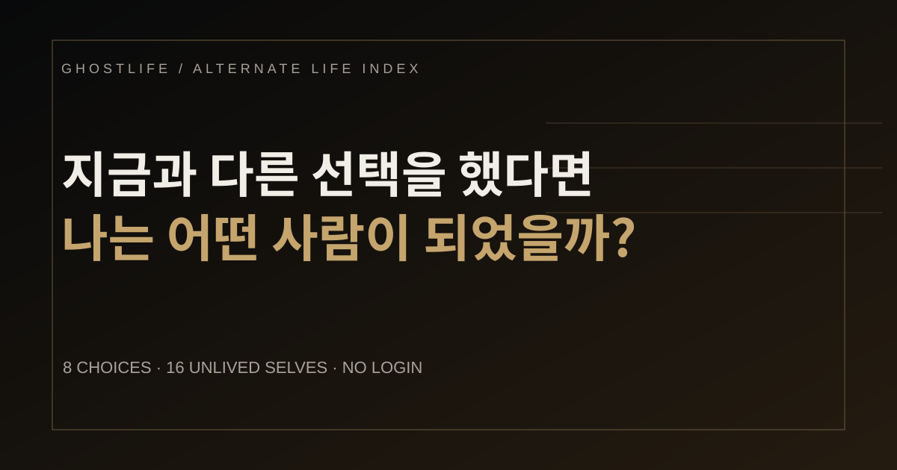
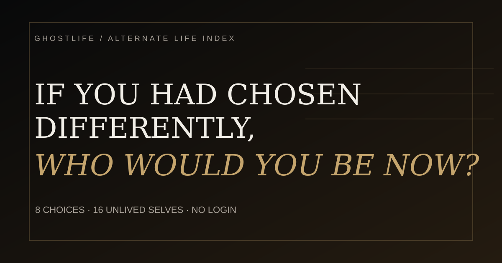

# GHOSTLIFE

<p align="center">
  
</p>

**What if one different choice had changed your entire life?**

GHOSTLIFE is an open-source alternate-life identity experience.  
Eight imagined scenes lead to one of sixteen lives you never lived.

**[Live Demo](https://chirpyworks.github.io/ghostlife/)** · MIT · Vanilla JS · KR/EN · No login · No backend

---

## Why this project exists

Most personality tests try to tell you who you are.

GHOSTLIFE asks a different question:

> **If you had chosen differently, who would you be now?**

It is not a psychological diagnosis. It is a small interactive fiction built from choices, identity, visual systems, and shareable outcomes.

## What you can do

- choose between 4 options across 8 scenes
- land on 1 of 16 alternate-life archetypes
- switch between Korean and English copy written independently for each language
- save a generated result poster
- invite a friend and compare two GHOST codes
- share a dual-result scene
- remix the questions, archetypes, scoring, or visual grammar

<p align="center">
  
</p>

## Architecture

GHOSTLIFE intentionally stays framework-free.

```text
ghostlife/
├─ index.html              # application shell
├─ styles/
│  └─ main.css             # visual system + responsive layout
├─ src/
│  ├─ data.js              # KR/EN questions, archetypes, UI copy, visual profiles
│  ├─ scoring.js           # pure scoring function
│  ├─ analytics.js         # GA4/local event adapter
│  └─ app.js               # UI state, rendering, sharing, compare flow
├─ tests/
│  └─ project.test.js      # exhaustive 4^8 scoring + bilingual integrity checks
├─ privacy.html
├─ en.html                 # English social-share entry page
└─ .github/workflows/      # QA, release guard, OG image rendering
```

More detail: [docs/ARCHITECTURE.md](docs/ARCHITECTURE.md)

## Scoring model

The experience uses four latent axes:

- **STAY ↔ LEAVE**
- **ORDER ↔ IMPULSE**
- **HIDDEN ↔ SEEN**
- **BUILD ↔ EXPERIENCE**

Together they resolve to 16 archetype keys.

The repository includes an exhaustive test of all **65,536 possible answer paths**.  
Each of the 16 archetypes is reachable by exactly **4,096 paths**.

Run it with:

```bash
node tests/project.test.js
```

## Run locally

There is no build step and no package install.

```bash
git clone https://github.com/chirpyworks/ghostlife.git
cd ghostlife
python3 -m http.server 8080
```

Then open:

`http://localhost:8080`

## Remix it

The easiest places to start:

- rewrite questions → `src/data.js`
- replace the 16 archetypes → `src/data.js`
- change the scoring behavior → `src/scoring.js`
- change the visual language → `styles/main.css` + visual profiles in `src/data.js`
- change share / compare behavior → `src/app.js`

Please avoid literal KR↔EN translation when contributing copy. Each language should read as if it was written natively.

See [CONTRIBUTING.md](CONTRIBUTING.md).

## Product event taxonomy

The current build can emit:

`test_start` · `test_complete` · `result_view` · `poster_export` · `share_intent` · `share_export` · `compare_invite` · `compare_create` · `compare_visit` · `retake`

Google Signals and ad-personalization signals are disabled in the public build.

## Open source

Released under the [MIT License](LICENSE).

Fork it. Rewrite it. Turn it into a different choice game. Use the scoring skeleton for another experiment.

Original concept, implementation and art direction: **chirpyworks / RUDA**.

If you build something interesting from it, a link back to GHOSTLIFE is appreciated.
